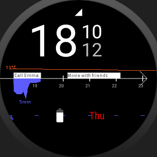
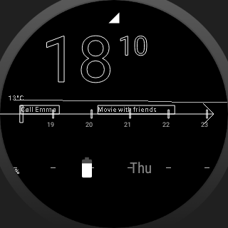
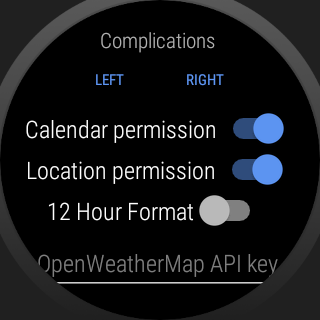

# Overview watch face

A watch face for Wear OS displaying upcoming meetings and weather at a glance.

Preview of the default view:

Ambient mode for saving battery power:

Settings Activity:

## Feature overview:
* Digital time display with seconds
* Ambient mode for saving battery
* Timeline displaying upcoming events
* Calendar integration to show events and meetings
* Weather display using OpenWeatherMap
  * Temperature graph
  * Minutely precipitation for next hour
  * Hourly probability of precipitation
  * At your location
* Two customizable Android watch complications (for battery, date, notifications, steps, ...)
* Settings activity for managing permissions, complications, Weather API key and 12/24h format
* Open Source and customizable

## Usage:
* To install the watch face you can open the repository in Android Studio and run it on your watch
* You can access the settings from the watch face selection screen
* Before the integration of calendar and weather works, you need to grant permissions to use
  * Calendar to query the calendar synchronized between your phone and watch
  * Location to query the weather at your location
* To receive weather data, an OpenWeatherMap API key is needed. It can be generated for free [here](https://openweathermap.org/appid) and entered in the settings.

## Project:
* This is a hobby project under GPL 3.0 license
* I would be happy to include your ideas and pull requests to add new features, fix bugs or improve the layout.
